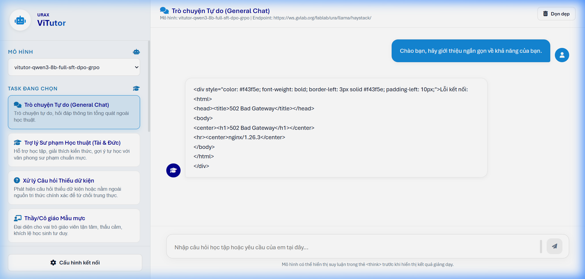

# ViTutor Chat - Trợ lý Học thuật Thông minh (URAx Team)

Giao diện thử nghiệm (Chat UI) được thiết kế hiện đại, mượt mà và tối ưu riêng cho dòng mô hình ngôn ngữ lớn **ViTutor** nhằm hỗ trợ học tập và giảng dạy phổ thông tại Việt Nam.

Sản phẩm được phát triển bởi nhóm **URAx**.

---

## 📸 Giao diện ứng dụng

### 1. Màn hình chính (Trò chuyện & Cấu hình prompt)


### 2. Cấu hình Kết nối API


---

## ✨ Tính năng nổi bật

1. **Giao diện sáng (Light Mode) thanh lịch**: Phối hợp hài hòa giữa màu sắc thương hiệu, hiệu ứng đổ bóng mờ và các góc bo tròn hiện đại giúp tăng tính tập trung khi học tập. Sử dụng font chữ hệ thống **Aptos** mang lại cảm giác cao cấp.
2. **Quản lý Task đa dạng & Dynamic Prompting**:
   - Tự động hiển thị danh sách các tác vụ chuyên biệt (Trò chuyện tự do, Trợ lý sư phạm, Giải trắc nghiệm CoT, Chấm điểm tự luận, Hỗ trợ tâm lý...).
   - **Tải Prompt động từ File**: Toàn bộ System Prompt được đọc trực tiếp từ các file cấu hình `.txt` gốc trong thư mục `/prompts/` bằng Javascript (`fetch()`) nhằm đảm bảo tính toàn vẹn và chính xác tuyệt đối so với mô hình huấn luyện.
   - Hỗ trợ cơ chế ghép Preamble sư phạm gốc (`inference_tutor_preamble_vi.txt`) và xử lý các tham số `{n}`, `{letters}` linh hoạt.
3. **Hiển thị suy luận thông minh**: Trích xuất thẻ `<think>...</think>` của các dòng mô hình suy luận (như GRPO/R1) và hiển thị thành hộp thoại mở rộng/thu gọn đẹp mắt có biểu tượng hoạt họa.
4. **Hỗ trợ công thức Toán học (KaTeX)**: Biên dịch nhanh chóng và chính xác các công thức toán học định dạng LaTeX.
5. **Proxy Backend chống CORS**: Server Python siêu nhẹ, không phụ thuộc thư viện ngoài giúp phục vụ giao diện tĩnh và đóng vai trò proxy chuyển tiếp luồng dữ liệu (SSE - Server Sent Events) từ client tới API vLLM, giúp tránh lỗi CORS trên trình duyệt.

---

## 🛠️ Cấu trúc thư mục

```text
vitutor_chat/
├── index.html          # Cấu trúc giao diện ứng dụng (HTML5)
├── style.css           # Định nghĩa giao diện, phong cách, hiệu ứng (CSS3)
├── app.js              # Logic ứng dụng, xử lý Markdown/LaTeX, API streaming
├── server.py           # Web server & Proxy chuyển tiếp API (Python 3)
├── prompts/            # Thư mục chứa các file System Prompt gốc (.txt)
└── screenshots/        # Hình ảnh minh họa giao diện (.png)
```

---

## 🚀 Hướng dẫn cài đặt và Chạy ứng dụng

### Bước 1: Khởi động API Server vLLM
Đảm bảo bạn đã khởi động mô hình ViTutor thông qua vLLM ở cổng mặc định hoặc cổng tùy chỉnh. Ví dụ:
```bash
python -m vllm.entrypoints.openai.api_server \
    --model vitutor-qwen3-8b-full-sft-dpo-grpo \
    --port 8000
```

### Bước 2: Chạy Server giao diện Chat
Chạy web server tích hợp bằng Python (không cần cài thêm bất cứ thư viện nào):
```bash
python server.py
```
Mặc định server sẽ khởi chạy tại cổng **`8080`**.

### Bước 3: Truy cập ứng dụng
Mở trình duyệt và truy cập: **`http://localhost:8080`**

### Bước 4: Thiết lập kết nối (nếu cần)
1. Nhấp vào nút **"Cấu hình kết nối"** ở góc dưới thanh bên.
2. Điều chỉnh **API Endpoint** (nếu bạn sử dụng proxy vLLM khác, mặc định đã được cấu hình trỏ tới cổng chuyển tiếp cục bộ).
3. Điều chỉnh **Nhiệt độ (Temperature)** phù hợp cho từng tác vụ trắc nghiệm (thường là `0.0`) hoặc hội thoại tự do (thường từ `0.6` đến `0.7`).
4. Nhấn **Lưu cấu hình** để áp dụng.

---

## 📄 Bản quyền và phát triển

Dự án được xây dựng và tối ưu bởi nhóm phát triển **URAx**. Toàn bộ các file prompts học thuật và giải trắc nghiệm được kế thừa trực tiếp từ kho ngữ liệu huấn luyện của dự án **ViTutor**.
